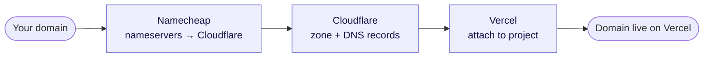
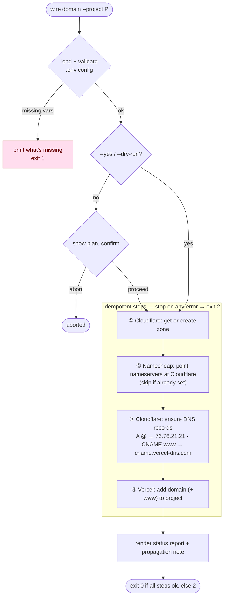
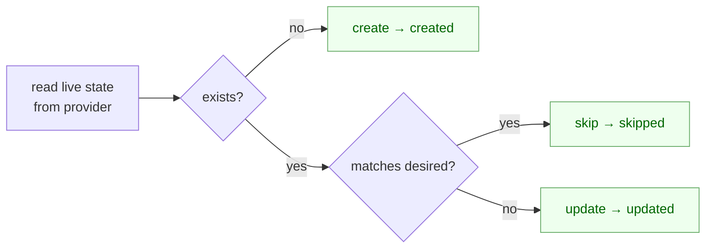
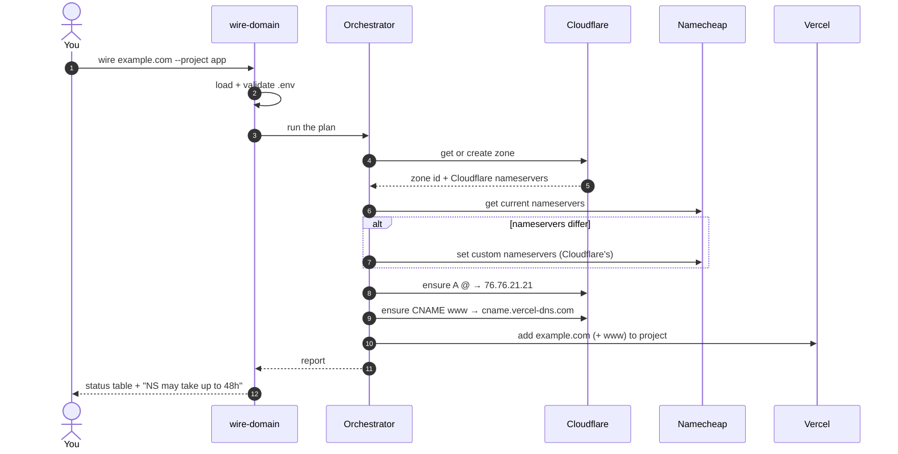
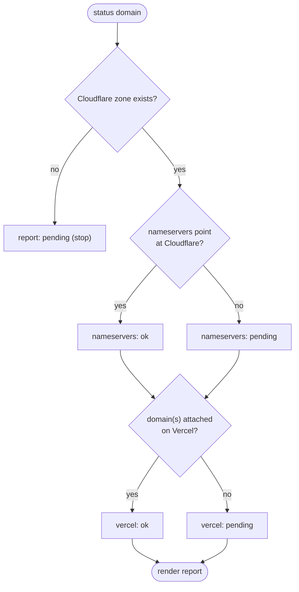
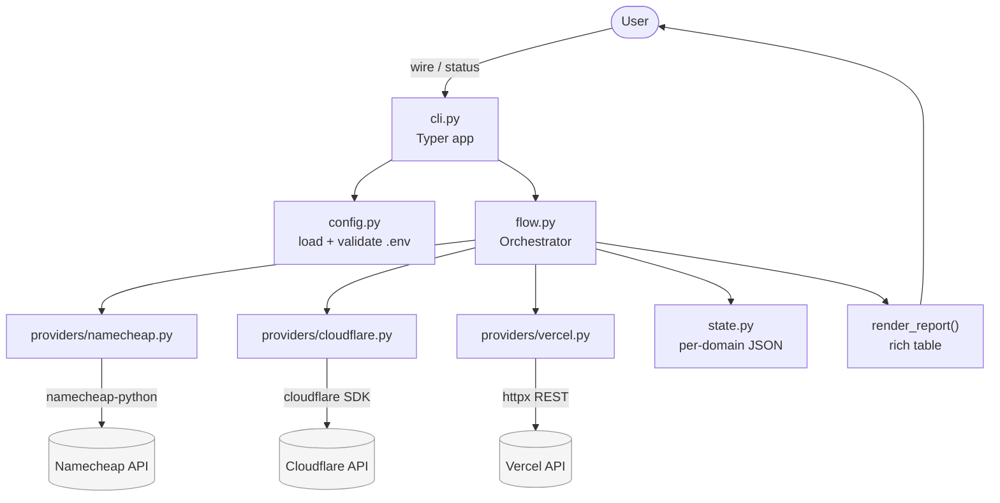

# wire-domain

**Wire an already-registered domain across Namecheap → Cloudflare → Vercel — in one command, idempotently.**

`wire-domain` automates the tedious, error-prone dance of pointing a domain you
already own at a Vercel project: it points your Namecheap nameservers at
Cloudflare, creates the Cloudflare zone and the DNS records Vercel needs, and
attaches the domain (and `www`) to your Vercel project. Every step detects
existing state first, so **running it twice is always safe.**



> **Scope:** the domain must already be registered in your Namecheap account.
> `wire-domain` does **not** buy domains — Namecheap's only job here is the
> nameserver switch.

---

## Table of contents

- [Why](#why)
- [How it works](#how-it-works)
- [Install](#install)
- [Configure](#configure)
- [Usage](#usage)
- [DNS records created](#dns-records-created)
- [Behavior: idempotency & propagation](#behavior-idempotency--propagation)
- [Exit codes](#exit-codes)
- [Architecture](#architecture-for-contributors)
- [Development](#development)
- [Contributing](#contributing)
- [License](#license)

---

## Why

Connecting a registrar → DNS → host by hand means clicking through three
dashboards, copying nameservers, hand-entering DNS records with the exact right
values, and remembering to turn Cloudflare proxying **off** so Vercel can issue
certificates. Miss one step and you get a half-broken domain that's painful to
debug. `wire-domain` does the whole chain deterministically and tells you
exactly what it changed.

---

## How it works

`wire-domain wire <domain>` runs four idempotent steps in order. Each step
reads live provider state first, then **skips**, **updates**, or **creates** —
so a re-run only does what's actually missing. Any error stops the flow and
exits non-zero.



### The idempotency rule (every step follows it)

Live provider state is authoritative; the local state file is only a cache and
audit trail. Deleting it never changes correctness.



### Who talks to whom (first run, happy path)



### `status` — read-only

`wire-domain status <domain>` never changes anything. It inspects live state
across all three providers and reports where the domain stands.



---

## Install

Requires **Python 3.11+** and [uv](https://docs.astral.sh/uv/).

```bash
git clone https://github.com/<your-org>/wire-domain.git
cd wire-domain
uv sync
```

This creates the virtual environment and installs everything (uv will fetch a
compatible Python if you don't have 3.11+).

---

## Configure

Copy the example env file and fill in your credentials:

```bash
cp .env.example .env
# then edit .env
```

`wire-domain` validates all required variables up front and prints a table
(with secrets masked) before doing anything. Missing variables fail fast with a
clear message and exit code `1`.

| Variable | Required | Purpose |
|----------|----------|---------|
| `NAMECHEAP_API_USER` | ✅ | Namecheap API user |
| `NAMECHEAP_API_KEY` | ✅ | Namecheap API key |
| `NAMECHEAP_USERNAME` | ✅ | Namecheap account username |
| `NAMECHEAP_CLIENT_IP` | ✅ | Your public IP, whitelisted in Namecheap's API settings |
| `NAMECHEAP_SANDBOX` | — | `true` to use Namecheap's sandbox (default `false`) |
| `CLOUDFLARE_API_TOKEN` | ✅ | Token with **Zone:Edit** + **DNS:Edit** |
| `CLOUDFLARE_ACCOUNT_ID` | — | Only if the token can see multiple accounts |
| `VERCEL_TOKEN` | ✅ | Vercel access token |
| `VERCEL_TEAM_ID` | — | Only for team-scoped projects |
| `VERCEL_PROJECT` | — | Default project when `--project` is omitted |

### Provider prerequisites

- **Namecheap:** the domain is already in your account; API access is enabled
  and your public IP is whitelisted (`NAMECHEAP_CLIENT_IP`).
- **Cloudflare:** an API token scoped to **Zone:Edit** and **DNS:Edit**.
- **Vercel:** a token and a target project.

---

## Usage

### Wire a domain

```bash
# Full wire (shows the plan, then asks for confirmation)
uv run wire-domain wire example.com --project my-project

# Preview everything without changing anything
uv run wire-domain wire example.com --project my-project --dry-run

# Non-interactive (skip the confirmation prompt)
uv run wire-domain wire example.com --project my-project --yes

# Apex only, no www
uv run wire-domain wire example.com --project my-project --no-www

# Full tracebacks on error
uv run wire-domain wire example.com --project my-project --verbose
```

**Flags for `wire`:**

| Flag | Default | Meaning |
|------|---------|---------|
| `--project` | `VERCEL_PROJECT` env | Vercel project to attach the domain to |
| `--www` / `--no-www` | `--www` | Also create the `www` CNAME and attach `www.<domain>` |
| `--dry-run` | off | Print intended changes, apply none |
| `--yes` | off | Skip the confirmation prompt |
| `--state-dir` | `~/.wire-domain/state` | Where the per-domain state file lives |
| `--verbose` | off | Full tracebacks on error |

### Check status

```bash
# Read-only report across all three providers
uv run wire-domain status example.com --project my-project
```

**Flags for `status`:** `--project`, `--www` / `--no-www`, `--state-dir`,
`--verbose` (same meanings as above; `status` never writes).

---

## DNS records created

`wire-domain` ensures exactly these records on Cloudflare (proxying **off** so
Vercel can serve traffic and issue certificates directly):

| Type | Name | Value | Proxied | When |
|------|------|-------|---------|------|
| `A` | `@` | `76.76.21.21` | off | always |
| `CNAME` | `www` | `cname.vercel-dns.com` | off | with `--www` (default) |

---

## Behavior: idempotency & propagation

**Idempotency.** Re-running `wire` is safe. If the nameservers already point at
Cloudflare, the zone already exists, or the records/Vercel domains are already
correct, those steps are skipped; anything wrong is updated in place. A
per-domain state file (`~/.wire-domain/state/<domain>.json`, override with
`--state-dir`) records progress as a cache and audit trail — but live provider
state always wins, so deleting the file never breaks anything.

**Nameserver propagation.** Nameserver changes can take minutes to 48 hours to
propagate. The Cloudflare zone stays **pending** until it completes.
`wire-domain` reports this and does **not** wait — check back later with
`uv run wire-domain status <domain>`.

---

## Exit codes

| Code | Meaning |
|------|---------|
| `0` | Success |
| `1` | Configuration error (missing/invalid env vars, or no Vercel project resolved) |
| `2` | A step failed (provider/API error) |

---

## Architecture (for contributors)

A thin CLI validates config and hands off to an orchestrator, which drives three
provider wrappers. Each wrapper isolates one external API behind a small,
injectable interface — which is what makes the whole thing testable without a
network.



| Module | Responsibility |
|--------|----------------|
| `cli.py` | Typer commands, flags, exit codes, confirmation, error rendering |
| `config.py` | Load `.env`, validate, masked config table |
| `flow.py` | Orchestrate the four idempotent steps; render the report |
| `providers/namecheap.py` | Read/set nameservers ([namecheap-python](https://github.com/adriangalilea/namecheap-python)) |
| `providers/cloudflare.py` | Get-or-create zone, ensure DNS records (official Cloudflare SDK) |
| `providers/vercel.py` | Add/list project domains (Vercel REST via `httpx`) |
| `state.py` | Per-domain resumable JSON state |
| `errors.py` / `models.py` | Shared exception hierarchy and dataclasses |

---

## Development

```bash
uv sync            # install deps (incl. dev)
uv run pytest -v   # run the test suite
```

Tests are fully hermetic — no real network calls. Provider SDKs are mocked and
Vercel's REST calls go through `httpx.MockTransport`, so the suite exercises
real create/skip/update behavior, error paths, and dry-run write-suppression
without touching any account.

Run the CLI locally against the assembled package:

```bash
uv run wire-domain --help
uv run python -m wire_domain --help
```

---

## Contributing

Contributions are welcome! Please:

1. Open an issue to discuss substantial changes before starting.
2. Keep the test suite green (`uv run pytest`) and add tests for new behavior —
   the providers are dependency-injected specifically so new cases can be
   covered without a network.
3. Keep each module focused on its single responsibility (see the table above).

---

## License

Released under the [MIT License](LICENSE).
