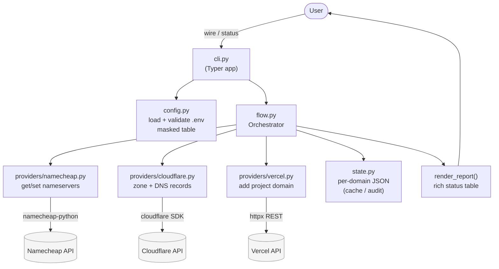
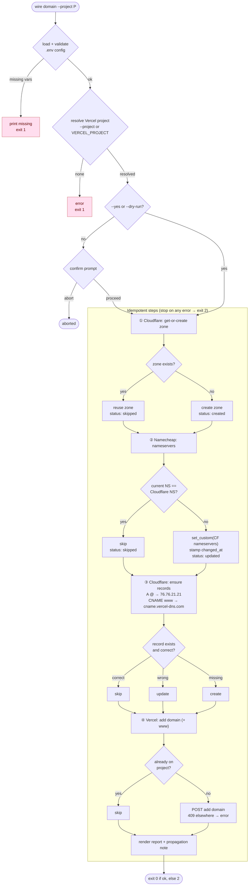
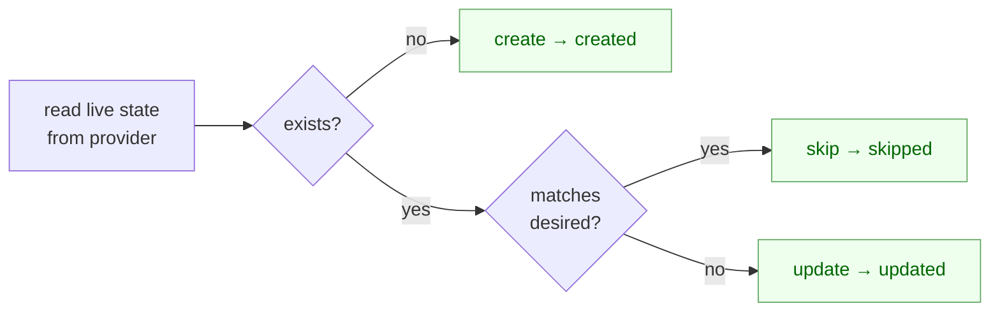
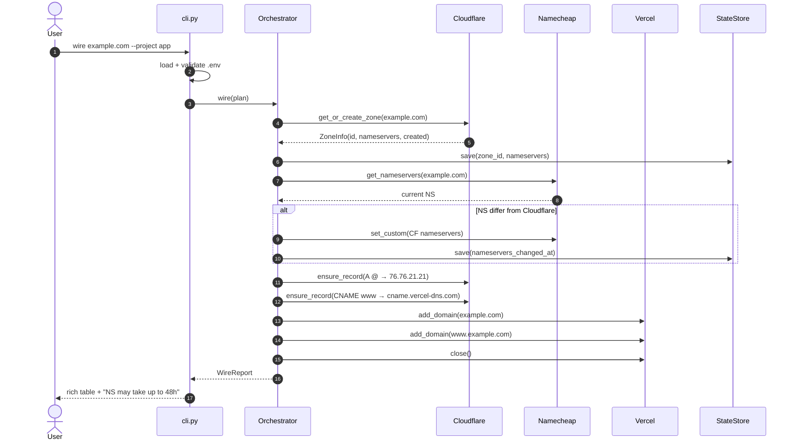
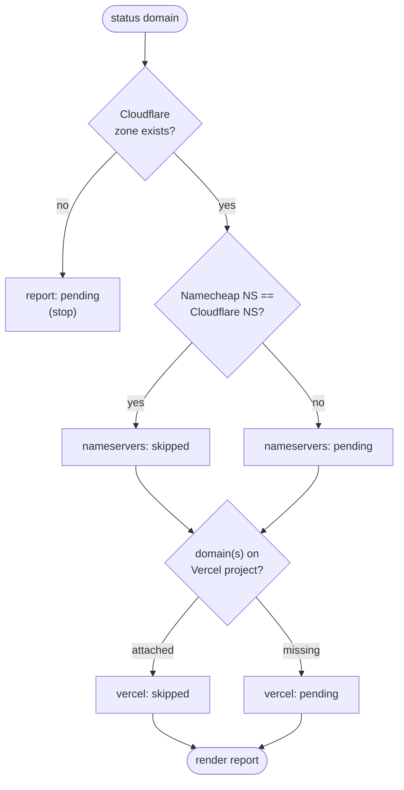
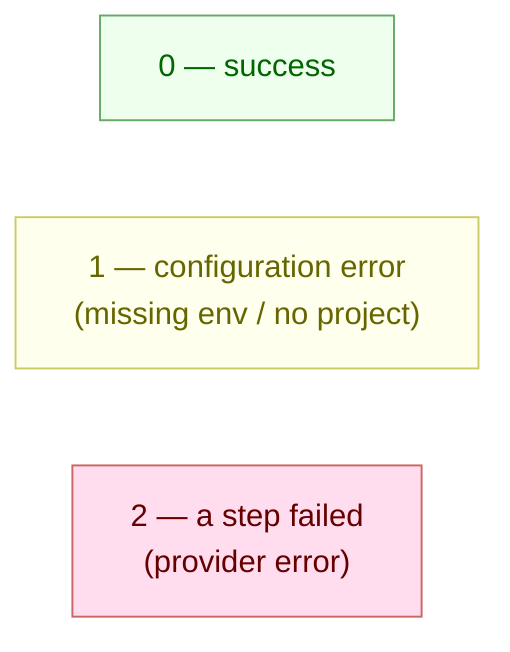

# wire-domain — Process Diagrams

Visual explanation of how `wire-domain` takes an **already-registered** domain and
wires it end-to-end: **Namecheap (registrar) → Cloudflare (authoritative DNS) →
Vercel (hosting)**. Every step is idempotent — re-running is always safe.

---

## 1. Architecture at a glance

How the pieces fit together. The CLI validates config, the orchestrator runs the
steps, and three thin provider wrappers isolate each external API.

---

## 2. The `wire` command — full flow

The four idempotent steps in order. Each step detects existing state first, so it
**skips**, **updates**, or **creates** as needed. Any `WireError` stops the flow and
exits `2`.

---

## 3. Idempotency decision (applies to every step)

The rule each provider follows. This is why the tool is safe to re-run at any time —
**live provider state is authoritative**, the state file is only a cache/audit trail.

---

## 4. The `wire` command — sequence view

Same flow as a sequence, showing who talks to whom (happy path, first run).

---

## 5. The `status` command — read-only

`status` never mutates anything. It inspects live state across all three providers
and reports. If no zone exists yet, it stops early.

---

## 6. Exit codes

---

## Notes

- **Registration is out of scope** — the domain must already exist in the Namecheap
  account. Namecheap's only job here is the nameserver switch.
- **Nameserver propagation** can take minutes to 48 hours. The Cloudflare zone stays
  `pending` until it completes; `wire-domain` reports this but does not wait.
- **State file** (`~/.wire-domain/state/<domain>.json`) is a cache and audit trail
  only. Deleting it never changes correctness — live provider state always wins.
